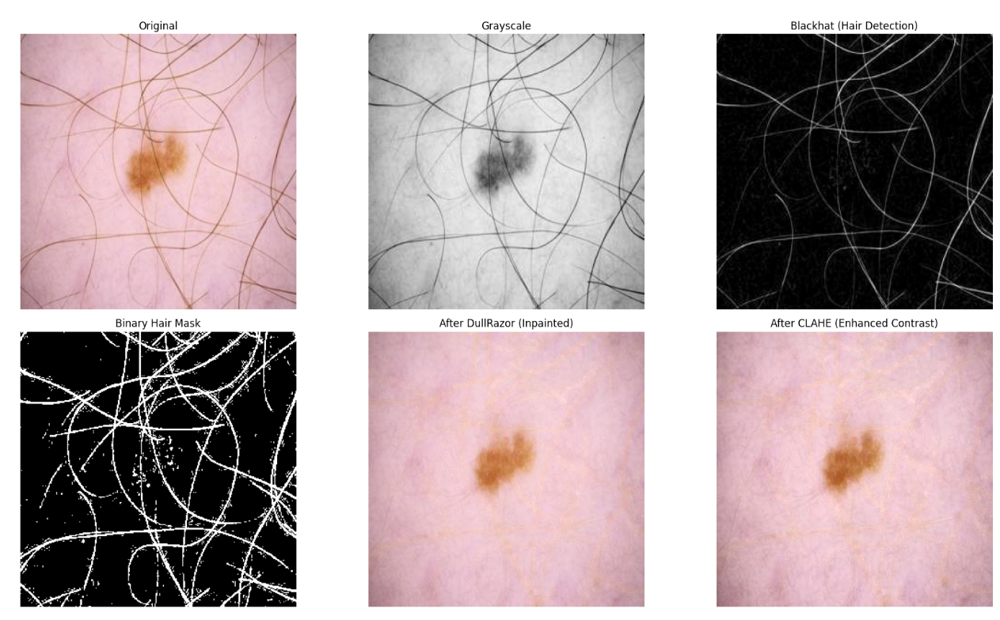
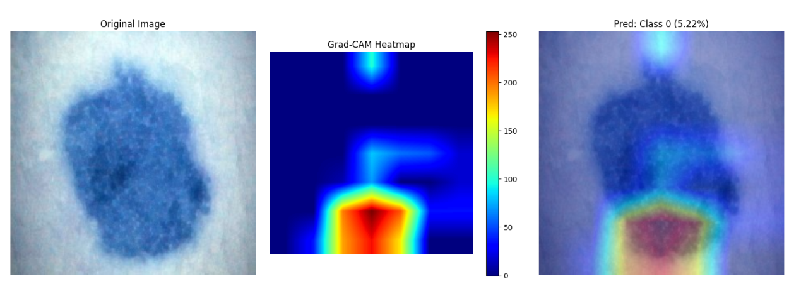
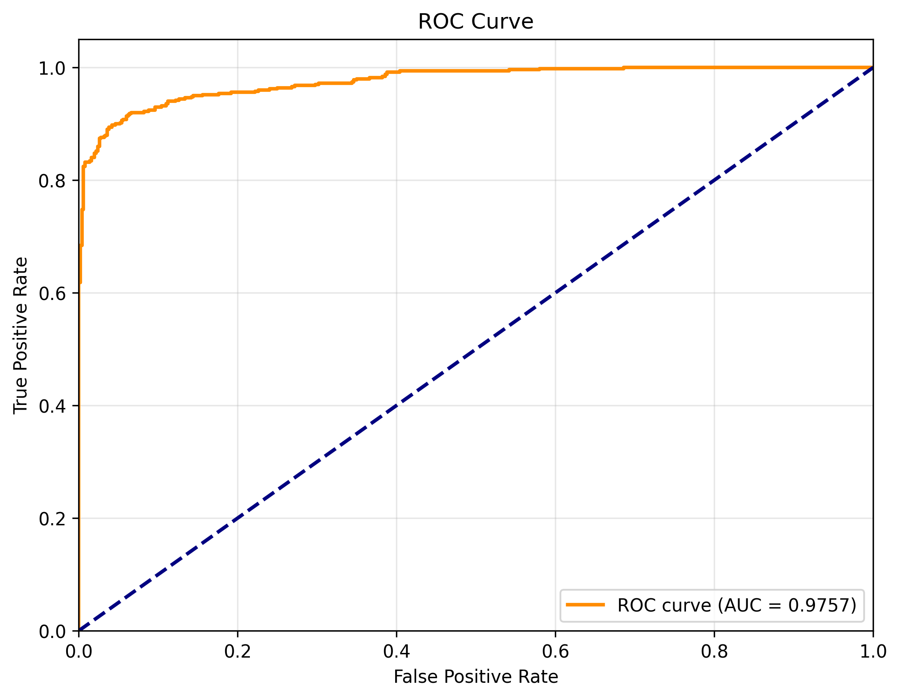

# Explainable Skin Cancer Classification Using Hair Artifact Removal and DenseNet-Based Deep Learning

## 🔍 Overview

This project presents a comprehensive deep learning approach for automated **Melanoma classification** from dermoscopic images using **DenseNet121 architecture** enhanced with advanced preprocessing techniques and explainable artificial intelligence (XAI). The system achieves **92.70% test accuracy** and provides clinical interpretability through **Grad-CAM visualizations**.

**🎯 Key Contributions:**
- Advanced preprocessing pipeline combining DullRazor hair removal with CLAHE contrast enhancement
- Transfer learning with DenseNet121 for efficient binary classification
- Explainable AI integration using Grad-CAM for clinical interpretability

## ✨ Key Features

- **Advanced Image Preprocessing**
  - DullRazor algorithm for effective hair artifact removal
  - CLAHE (Contrast Limited Adaptive Histogram Equalization) for enhanced contrast
  - Automated image normalization and resizing

- **Deep Learning Model**
  - DenseNet121 architecture with transfer learning from ImageNet
  - Fine-tuned for melanoma detection with last 60 layers unfrozen
  - Custom classification head with dropout regularization

- **Explainable AI**
  - Grad-CAM visualization for model interpretability
  - Heatmap generation highlighting critical regions
  - Clinical decision support through visual explanations

## 🏗️ Architecture

The system architecture consists of three main components:

1. **Preprocessing Pipeline**
   ```
   Raw Image → Hair Removal (DullRazor) → CLAHE Enhancement → Normalization → Resized (224×224)
   ```

   


2. **DenseNet121 Model**
   - Base Model: DenseNet121 (pre-trained on ImageNet)
   - Fine-tuning: Last 60 layers unfrozen
   - Classification Head: GlobalAveragePooling → Dense(512, ReLU) → Dropout(0.5) → Dense(1, Sigmoid)

3. **Explainability Module**
   - Grad-CAM implementation for visual explanations
   - Heatmap overlay on original images
   - Clinical interpretability support

                   

## 📊 Dataset

- **Source**:[Melanoma Skin Cancer Dataset of 10000 Images](https://www.kaggle.com/datasets/hasnainjaved/melanoma-skin-cancer-dataset-of-10000-images).
- **Size**: 10,000 dermoscopic images
- **Classes**: Binary classification
  - Benign (Class 0): 5,000 images
  - Malignant (Class 1): 5,000 images


## 📈 Results

### Performance Metrics

| Metric | Score |
|--------|-------|
| **Test Accuracy** | 92.70% |
| **Precision** | 95.91% |
| **Recall** | 89.20% |
| **F1-Score** | 92.44% |
| **ROC-AUC** | 0.9812 |
 
### Comparison with Baseline Models

| Model | Accuracy | Precision | Recall |
|-------|----------|-----------|--------|
| CNN + GoogleNet | 86.7% | 61.0% | 51.6% |
| DCNN | 90.16% | 90.63% | 93.91% |
| VG16 + ResNet + CapsNet | 93.5% | 94.0% | 87.0% |
| DenseNet-121 (Baseline) | 90.6% | 93.38% | 87.0% |
| **Our Model (DenseNet-121 + HairRemoval + CLAHE Contrast)** | **92.6%** | **95.13%** | **89.8%** |


### Confusion Matrix & ROC-AUC curve:
<table>
  <tr>
    <td></td>
    <td></td>
  </tr>
</table>

## 🛠️ Technologies Used

### Core Libraries
- **Python 3.8+**: Programming language
- **TensorFlow 2.x**: Deep learning framework
- **Keras**: High-level neural networks API
- **OpenCV**: Image processing and computer vision

### Preprocessing & Visualization
- **NumPy**: Numerical computations
- **Pandas**: Data manipulation
- **Matplotlib**: Plotting and visualization
- **Seaborn**: Statistical data visualization

### Machine Learning
- **scikit-learn**: Machine learning utilities and metrics
- **SciPy**: Scientific computing

### Development Tools
- **Jupyter Notebook**: Interactive development

## 👥 Contributors


- **Punit** - [](https://www.linkedin.com/in/punit-garg-08b133308/)
- **Sawan Kumar Yadav** 
- **Nikhil Jain** – [LinkedIn Profile](https://www.linkedin.com/in/nikhil-jain-133b25279/)


## 📄 License

This project is licensed under the MIT License - see the [LICENSE](LICENSE) file for details.

